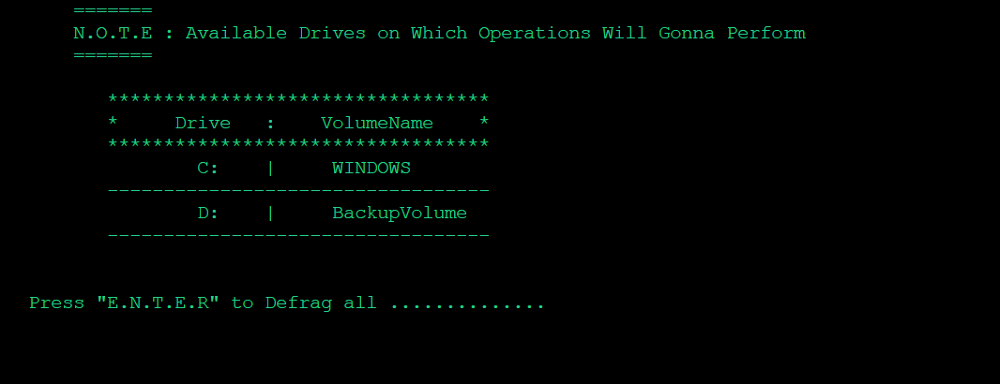

<h1 align="center">✨<i>System Optimizer</i>✨</h1>

<div align="center"></div>
<hr>

# _Basic Info :_

- **The Simple Tool For System Cleaning and Optimizing for best Performance **.****
- **It Simply Clean the Unnecessary files and Temporary One residing on your System **.****
<hr>
  
# _Some Glimse of Project👀 :_

 <p align="center"><br><div align="center"></div><br>
 
- _**When the USER executes the program the initial `welcome` banner get print on the Screen .**_
- _**It Displays the User Name for Current Login System.**_ <br>
- _**The Execution of Program Stops Once it Detects the Insufficient Priviledges .**_ <br>  


<div></div><br>

<div></div><br>

<div></div><br>
<div></div><br>

- _**The Shortcut for ShutDown and Restart are added , if already presents then neglects the Phase .**_
<hr>

# ⚙️ _**Steps For Installation :**_
- **Open Command Prompt as an `Administrator`**
- **Change Directory to following path :**

  ```cmd
  git clone https://github.com/nazar-ansari/System-Optimizer.git
  CD System-Optimizer\src
  Optimize.cmd
  .
  ```
<hr>

# 👨‍💻 _**Contibuting Guidelines** :_
- **Feel free to Make Your Great Contribution by following the [Contribution](./CONTRIBUTING.md) Guidelines .**
  
<hr>

# _**License:**_
- **This Project is License Under the MIT Guidelines See [License](./LICENSE.md) For more Details .**
<hr>
